# PostPilot AI — Architecture Diagrams

Auto-generated from source code analysis. All flows reflect actual implementation in `backend/app/` and `frontend/src/`.

---

## 1. System Architecture

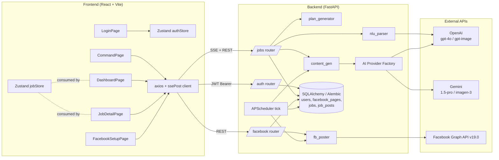

---

## 2. Data Model (ER)

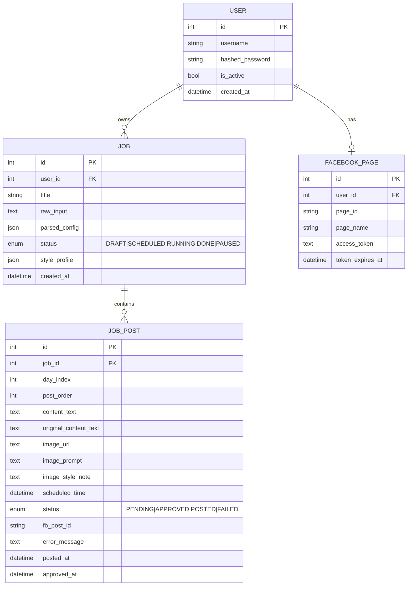

---

## 3. Agent Workflow / Logic Flow (PRIMARY)

PostPilot is a **single-shot LLM-orchestrated content pipeline** (not LangGraph / not ReAct multi-agent). The "agent" is a deterministic FastAPI orchestrator that invokes specialized LLM steps: NLU parser → planner → text generator → image-prompt developer → image generator → style profile extractor. APScheduler acts as a periodic executor that triggers downstream generation + posting.

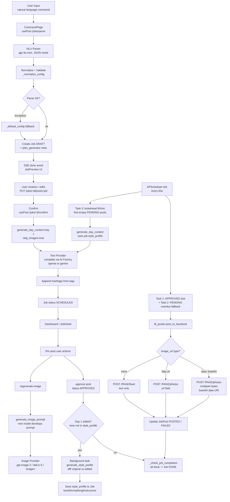

---

## 4. SSE Streaming Sequence — /jobs/parse

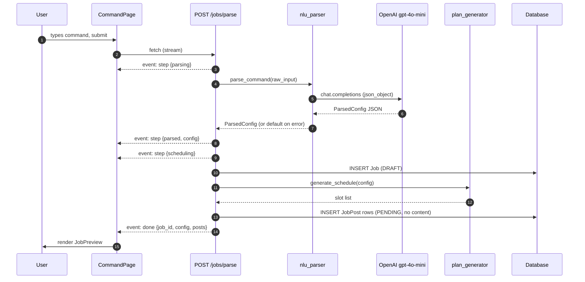

---

## 5. Confirm + Day-1 Generation Sequence — /jobs/:id/confirm

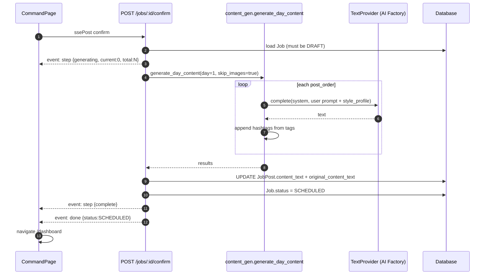

---

## 6. APScheduler Tick (every 60s)

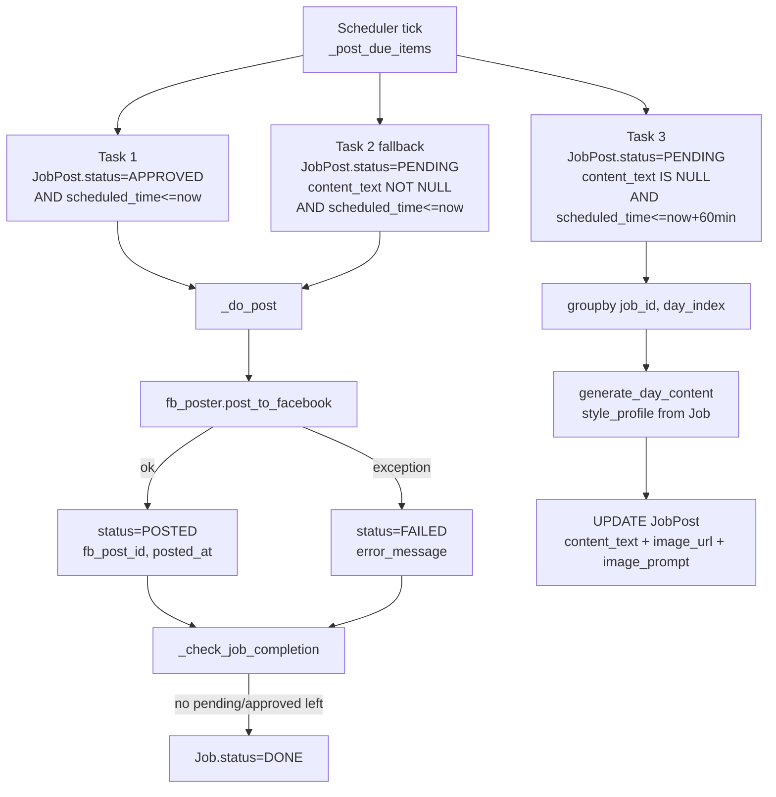

---

## 7. AI Provider Abstraction

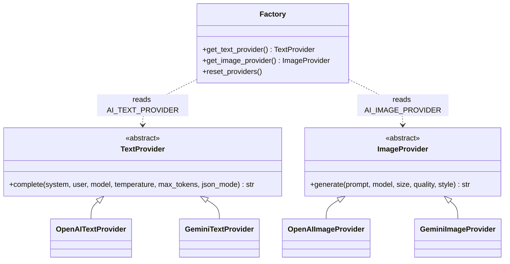

Selection is env-driven (`AI_TEXT_PROVIDER`, `AI_IMAGE_PROVIDER`) and providers are module-level singletons cached after first init.

---

## 8. Job & Post State Machines

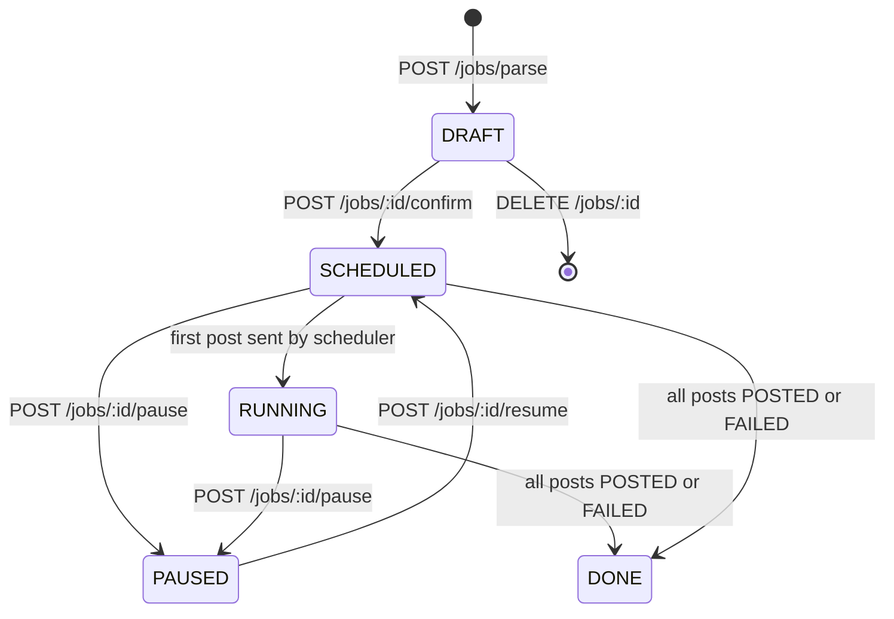

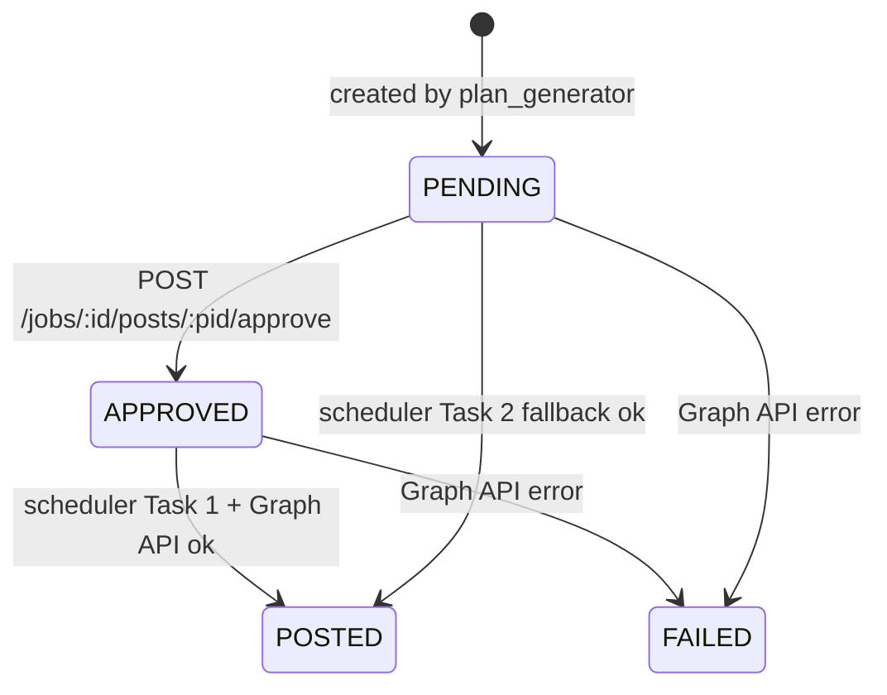

---

## 9. Authentication Flow

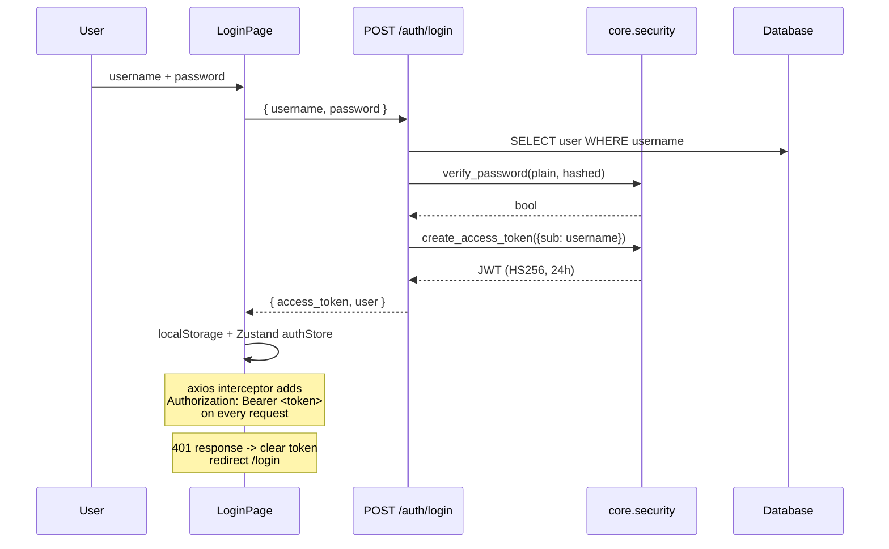

---

## 10. Facebook Token Setup Flow

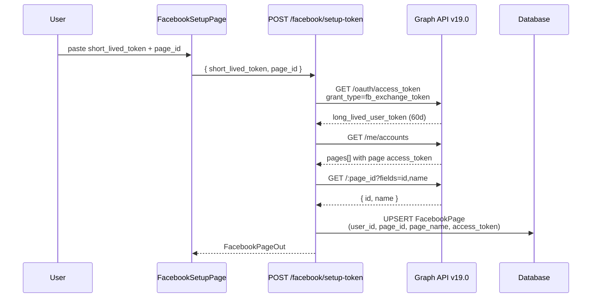

---

## 11. Frontend Routing

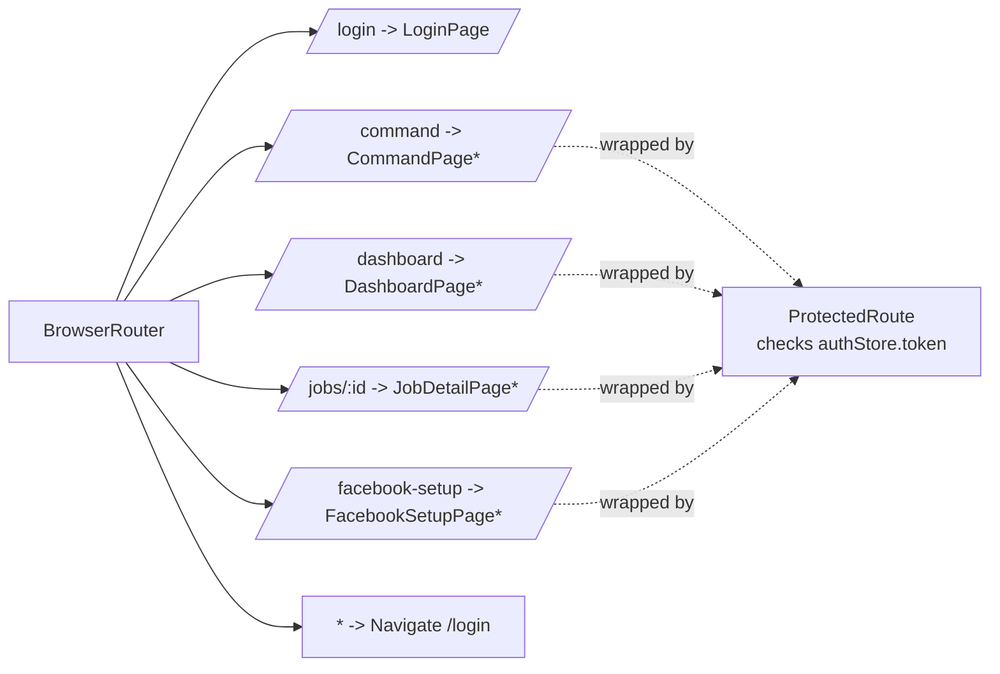

`*` = behind `ProtectedRoute` (redirects to `/login` when no token in Zustand authStore).

---

## 12. Style Profile Learning Loop

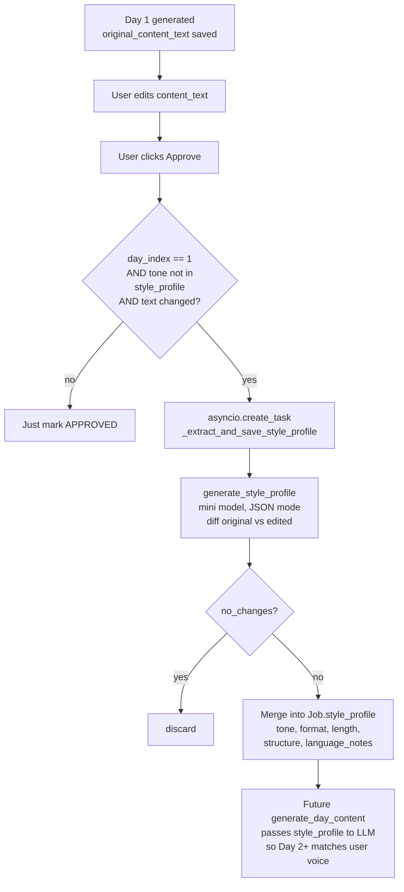

Image direction is captured separately: `image_style_note` from the Approve request is stored in `style_profile.image_direction` and consumed by `generate_image_prompt` as `[Style instruction]`.

---

## 13. Tech Stack Summary

| Layer | Technology |
|---|---|
| Frontend | React 18, Vite, TypeScript, React Router, Zustand, axios, framer-motion, TailwindCSS |
| Backend | FastAPI, SQLAlchemy, Alembic, Pydantic v2, APScheduler (AsyncIO), httpx |
| Auth | OAuth2PasswordBearer + JWT (HS256, 24h) via `python-jose` style helpers in `core.security` |
| DB | SQLite default (`postpilot.db`), Postgres-ready via `DATABASE_URL` |
| LLM (text) | OpenAI `gpt-4o` / `gpt-4o-mini` OR Gemini `1.5-pro` / `1.5-flash` (env-switched) |
| LLM (image) | OpenAI `gpt-image-2` / `dall-e-3` OR Gemini `imagen-3.0-generate-001` |
| Streaming | Server-Sent Events (FastAPI `StreamingResponse`, browser `fetch` reader) |
| External | Facebook Graph API v19.0 |
| Deploy | Railway (backend, `railway.json`), Vercel (frontend), Docker / docker-compose for dev |

Multi-agent orchestration framework (LangGraph, AutoGen, CrewAI): **Not detected from source code.**
ReAct / tool-use loop: **Not detected from source code.**
Vector DB / RAG retrieval: **Not detected from source code.**
Persistent agent memory beyond `Job.style_profile` JSON column: **Not detected from source code.**
